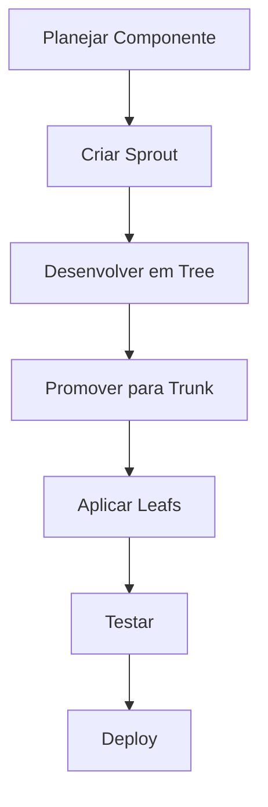
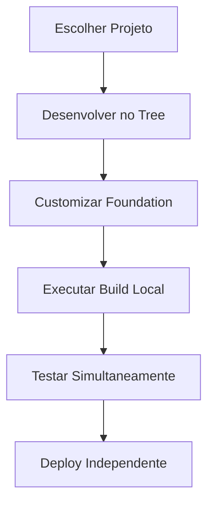

# Guia de Desenvolvimento

Este guia apresenta as melhores práticas e fluxo de trabalho para desenvolver com o sistema Growing.

## Visão Geral do Fluxo de Desenvolvimento

O desenvolvimento com Growing segue uma abordagem estruturada que combina Sprouts, Trunks e Leafs em um processo coeso.

### Fluxo Básico



### Fluxo com My Groves



## Configuração do Ambiente

### Estrutura de Diretórios Recomendada

```
project/
├── src/
│   ├── components/     # Componentes extraídos (Trunks)
│   ├── sprouts/        # Sprouts customizados
│   ├── trees/          # Arquivos Tree (_tree.scss)
│   ├── leafs/          # Leafs customizados
│   ├── pages/          # Páginas da aplicação
│   └── shared/         # Utilitários compartilhados
├── docs/               # Documentação
├── tests/              # Testes
├── growing.config.js   # Configuração
└── package.json
```

### Estrutura My Groves

```
My Groves/
├── project-alpha/
│   ├── tree.scss       # Desenvolvimento principal
│   ├── foundation/     # Identidade visual
│   │   └── palette.scss
│   ├── index.html      # Interface
│   └── vite.config.js  # Configuração específica
├── project-beta/
│   ├── tree.scss
│   ├── foundation/
│   ├── index.html
│   └── vite.config.js
└── shared/            # Recursos compartilhados
```

### Configuração do VS Code

```json
// .vscode/settings.json
{
  "growing.enable": true,
  "growing.autoExtract": true,
  "growing.lintOnSave": true,
  "growing.formatOnSave": true,
  "growing.theme": "auto",
  "editor.formatOnSave": true,
  "editor.codeActionsOnSave": {
    "source.fixAll": true
  }
}
```

## Desenvolvimento com Sprouts

### Estrutura de um Sprout

```scss
// sprouts/_button-primary.scss
@use '../../core/sprouts' as *;

// Definir variáveis do sprout
$sprout-button-primary: (
  'background': var(--interactive-primary),
  'color': var(--text-on-primary),
  'border-radius': var(--radius-md),
  'padding': var(--space-md),
  'transition': all 0.2s ease
);

// Aplicar sprout
.sprout-button-primary {
  @include sprout-button($sprout-button-primary);
}
```

### Boas Práticas para Sprouts

```scss
// ✅ BOM: Sprout bem estruturado
@use '../../core/sprouts' as *;

$sprout-card-product: (
  'layout': (
    'display': flex,
    'direction': column,
    'gap': var(--space-md)
  ),
  'image': (
    'aspect-ratio': 16/9,
    'border-radius': var(--radius-md)
  ),
  'content': (
    'padding': var(--space-md)
  )
);

.sprout-card-product {
  @include sprout-card($sprout-card-product);
}

// ❌ RUIM: Sprout mal estruturado
.sprout-card-bad {
  background: white;
  padding: 20px;
  border-radius: 8px;
  box-shadow: 0 2px 4px rgba(0,0,0,0.1);
}
```

## Desenvolvimento com My Groves

### Iniciando um Novo Projeto

```bash
# 1. Copiar projeto base
cp -r My\ Groves/example-project My\ Groves/meu-novo-projeto
cd My\ Groves/meu-novo-projeto

# 2. Personalizar identidade visual
edit foundation/palette.scss

# 3. Desenvolver componentes
edit tree.scss

# 4. Executar projeto
npm run dev
```

### Trabalhando com Múltiplos Projetos

```bash
# Terminal 1: Projeto A
cd My\ Groves/project-alpha && npm run dev

# Terminal 2: Projeto B
cd My\ Groves/project-beta && npm run dev

# Terminal 3: Projeto C
cd My\ Groves/project-gamma && npm run dev
```

### Desenvolvimento no Tree (My Groves)

```scss
// My Groves/meu-projeto/tree.scss
@use '../../src/soils' as soils;
@use '../../src/sprouts' as sprouts;
@use '../../src/trunks' as trunks;
@use 'foundation/palette' as palette;

// 1. Reset e base
@include soils.reset();
@include soils.typography-base();

// 2. Componentes customizados
.my-brand-header {
  @extend %trunk-header;
  background-color: palette.$primary;
  color: palette.$on-primary;

  .logo {
    font-size: 2rem;
    font-weight: 700;
  }
}

.my-brand-button {
  @include sprouts.button-base();
  background-color: palette.$secondary;
  color: palette.$on-secondary;
  border-radius: palette.$border-radius;

  &:hover {
    background-color: palette.$secondary-variant;
    transform: translateY(-2px);
  }
}

// 3. Layout específico do projeto
.project-layout {
  @include soils.layout-grid();
  min-height: 100vh;
  background-color: palette.$background;

  .sidebar {
    background-color: palette.$surface;
    border-right: 1px solid palette.$border-color;
  }

  .main-content {
    background-color: palette.$background;
    color: palette.$on-background;
  }
}
```

### Gerenciamento de Foundation

```scss
// foundation/palette.scss - Identidade visual própria
$primary: #1976d2;
$on-primary: #ffffff;
$primary-variant: #1565c0;

$secondary: #dc004e;
$on-secondary: #ffffff;
$secondary-variant: #c2185b;

$background: #fafafa;
$on-background: #212121;
$surface: #ffffff;
$on-surface: #212121;

$border-color: #e0e0e0;
$border-radius: 8px;
$border-radius-sm: 4px;
$border-radius-lg: 12px;
```

### Estratégias de Desenvolvimento

#### Desenvolvimento Paralelo

```bash
# Desenvolver múltiplos projetos simultaneamente
# Cada um em seu terminal
Terminal 1: cd My\ Groves/ecommerce && npm run dev    # http://localhost:3001
Terminal 2: cd My\ Groves/blog && npm run dev         # http://localhost:3002
Terminal 3: cd My\ Groves/dashboard && npm run dev    # http://localhost:3003
```

#### Compartilhamento de Componentes

```scss
// My Groves/shared-components/tree.scss
@use '../../src/soils' as soils;
@use '../../src/sprouts' as sprouts;

// Componentes compartilhados entre projetos
.shared-button {
  @include sprouts.button-base();
  // Estilos base compartilhados
}

.shared-card {
  @include sprouts.card-structure();
  // Estrutura base compartilhada
}
```

#### Customização por Projeto

```scss
// My Groves/project-a/tree.scss
@use '../shared-components/tree' as shared;
@use 'foundation/palette' as palette;

// Importar componentes compartilhados
.shared-button {
  // Customização específica do projeto A
  background-color: palette.$primary;
  color: palette.$on-primary;
}

// My Groves/project-b/tree.scss
@use '../shared-components/tree' as shared;
@use 'foundation/palette' as palette;

// Importar componentes compartilhados
.shared-button {
  // Customização específica do projeto B
  background-color: palette.$secondary;
  color: palette.$on-secondary;
}
```

### Estratégias de Adaptação

#### Adaptação Básica

```scss
// Extender diretamente
.main-button {
  @extend .sprout-button-primary;
  background-color: var(--brand-primary);
}
```

#### Adaptação com Modificações

```scss
// Modificar propriedades
.main-button {
  @extend .sprout-button-primary;

  // Modificações
  padding: var(--space-lg) var(--space-xl);
  font-size: var(--text-lg);
  border-radius: var(--radius-lg);

  // Estados
  &:hover {
    transform: translateY(-2px);
    box-shadow: var(--shadow-lg);
  }

  &:active {
    transform: translateY(0);
  }
}
```

#### Adaptação Responsiva

```scss
.main-button {
  @extend .sprout-button-primary;

  // Desktop
  padding: var(--space-lg) var(--space-xl);
  font-size: var(--text-lg);

  // Tablet
  @media (max-width: 768px) {
    padding: var(--space-md) var(--space-lg);
    font-size: var(--text-base);
  }

  // Mobile
  @media (max-width: 480px) {
    width: 100%;
    padding: var(--space-md);
  }
}
```

## Aplicação de Leafs

### Criando Leafs Customizados

```scss
// leafs/_brand-colors.scss
@use '../core/leafs' as *;

// Cores da marca
@include leaf-color('brand-primary', #ff6b35);
@include leaf-color('brand-secondary', #f7931e);
@include leaf-color('brand-accent', #00b894);

// Gradientes
@include leaf-gradient('brand-gradient',
  linear-gradient(135deg, leaf-color('brand-primary'), leaf-color('brand-secondary'))
);
```

### Aplicando Leafs

```html
<!-- Aplicar leafs diretamente no HTML -->
<button class="trunk-button leaf-bg-brand-primary leaf-text-on-primary leaf-rounded-lg">
  Botão da Marca
</button>

<!-- Aplicar leafs via atributo data -->
<div class="trunk-card" data-theme="brand">
  <h3>Card da Marca</h3>
</div>
```

```scss
// Aplicar leafs programaticamente
[data-theme="brand"] {
  @include leaf-bg('brand-primary');
  @include leaf-text('on-primary');
  @include leaf-border('brand-secondary');
}
```

## Desenvolvimento com Vite

### Servidor de Desenvolvimento

O projeto usa Vite como servidor de desenvolvimento. Para iniciar:

```bash
npm run dev
```

Isso iniciará o servidor de desenvolvimento com hot reload automático para mudanças em SCSS e HTML.

### Desenvolvimento com My Groves

```bash
# Executar projeto específico
cd My\ Groves/meu-projeto && npm run dev

# Executar múltiplos projetos (terminais diferentes)
cd My\ Groves/project1 && npm run dev  # Porta 3001
cd My\ Groves/project2 && npm run dev  # Porta 3002
cd My\ Groves/project3 && npm run dev  # Porta 3003
```

### Build para Produção

Para gerar os arquivos otimizados para produção:

```bash
npm run build
```

Os arquivos compilados serão gerados na pasta `dist/` com CSS minificado e otimizado.

### Build com My Groves

```bash
# Build de projeto específico
cd My\ Groves/meu-projeto && npm run build

# Build otimizado para produção
cd My\ Groves/meu-projeto && npm run build:prod

# Build múltiplos projetos
for dir in My\ Groves/*/; do
  if [ -d "$dir" ]; then
    echo "Building $dir"
    cd "$dir" && npm run build && cd ../..
  fi
done
```

### Preview da Build

Para visualizar a versão de produção localmente:

```bash
npm run preview
```

### Preview com My Groves

```bash
# Preview de projeto específico
cd My\ Groves/meu-projeto && npm run preview

# Preview em porta específica
cd My\ Groves/meu-projeto && npm run preview -- --port 4001
```

## Organização de Arquivos

### Estrutura Recomendada

```
src/
├── my-trunks.scss          # Personalizações principais
├── groves/                 # Agrupamentos temáticos
│   ├── buttons.scss       # Estilos de botões
│   ├── forms.scss         # Estilos de formulários
│   └── layout.scss        # Estilos de layout
├── harvest/               # Componentes específicos
│   ├── header.scss        # Estilo do header
│   ├── footer.scss        # Estilo do footer
│   └── cards.scss         # Estilos de cards
└── sparks/                # Utilitários e helpers
    ├── utilities.scss     # Classes utilitárias
    └── mixins.scss        # Mixins customizados
```

### Boas Práticas de Organização

1. **Mantenha a separação**: Use `my-trunks.scss` apenas para imports e overrides globais
2. **Agrupamento temático**: Organize estilos relacionados em arquivos específicos
3. **Reutilização**: Crie mixins e utilitários para código repetitivo
4. **Documentação**: Comente estilos complexos explicando o propósito

## Desenvolvimento Iterativo

### Workflow Básico

1. **Identificar necessidade**: Determine qual componente ou estilo precisa ser criado
2. **Verificar trunks existentes**: Consulte a documentação para ver se já existe um trunk adequado
3. **Criar/modificar estilos**: Use `my-trunks.scss` ou arquivos específicos para customizações
4. **Testar visualmente**: Use o servidor de desenvolvimento para verificar as mudanças
5. **Otimizar**: Refine os estilos para melhor performance e manutenibilidade

### Exemplo de Desenvolvimento

```scss
// 1. Importar base necessária
@use '../terrain/trunks' as *;

// 2. Criar componente customizado
.my-custom-card {
  @extend .trunk-card;

  // Customizações específicas
  border: 2px solid var(--brand-primary);
  box-shadow: var(--shadow-lg);

  // Estados interativos
  &:hover {
    transform: translateY(-4px);
    box-shadow: var(--shadow-xl);
  }
}

// 3. Adicionar ao arquivo principal
// Em my-trunks.scss
@use 'harvest/cards';
```

## Debugging e Manutenção

### Ferramentas de Desenvolvimento

- **DevTools**: Use as ferramentas do navegador para inspecionar estilos
- **Vite Dev Server**: Acompanhe mudanças em tempo real
- **Source Maps**: Debug do CSS original durante desenvolvimento

### Manutenção de Código

- **Comentários**: Documente decisões de design importantes
- **Variáveis consistentes**: Use sempre as variáveis do sistema
- **Testes visuais**: Verifique layouts em diferentes tamanhos de tela
- **Performance**: Monitore o tamanho dos arquivos CSS gerados

Este guia fornece uma base sólida para desenvolver aplicações robustas e escaláveis com o sistema Growing, seguindo as melhores práticas da indústria e aproveitando todo o potencial da arquitetura Sprout-Trunk-Leaf.